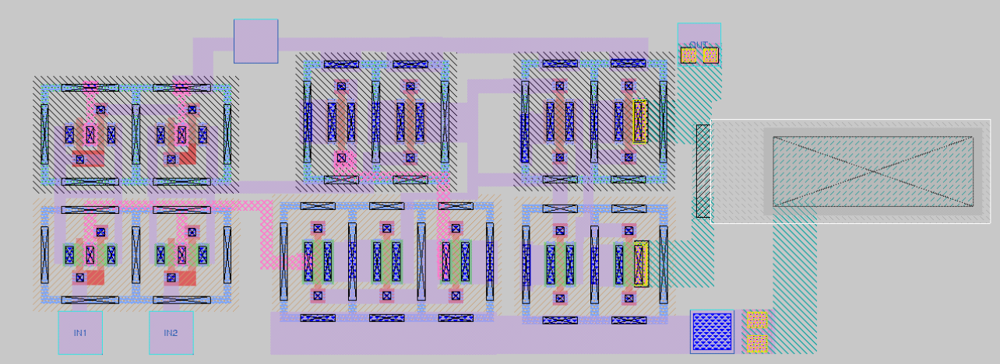

# Comparator Layout

Physical layout design for a comparator using Magic VLSI and Sky130nm PDK.

## Features

- Manual layout design with Magic VLSI (no auto place & route)
- Sky130nm open-source PDK
- Space-efficient design with guard ring sharing
- Multi-finger differential transistors for better matching
- All DRC violations resolved

## Files

- `comparator_for_layout.mag` - Magic layout file
- `comparator_for_layout.sch` - Xschem schematic  

## Tools Used

- Magic VLSI Layout Editor
- Sky130 PDK
- Xschem (schematic)
